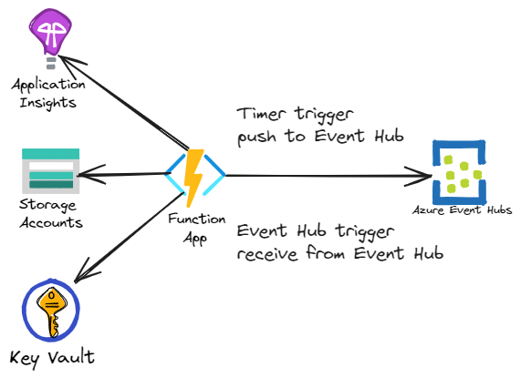
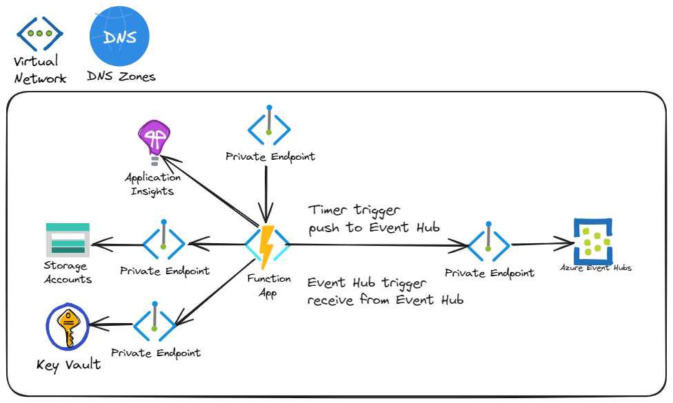

# Azure Function with Event Hub with Virtual Network features

[](https://codespaces.new/azure-samples/function-eventhub-vnet)

This template will deploy an Azure Function, Event Hub, and supporting resources, with optional virtual network integration and private endpoints.  The following Azure resources are utilized:

- Virtual network with two subnets (optional)
- Azure Function Premium plan
  - Optional support for virtual network integration
- Azure Function app
  - Optional support for virtual network private endpoint
- Application Insights
- Log Analytics workspace
- Key Vault
  - Optional support for virtual network private endpoint
  - Azure Storage connection string is set as a Key Vault secret
- Event Hub namespace and event hub
  - Optional support for virtual network private endpoint
- Storage account
  - Optional support for virtual network private endpoint

The function app will be configured to use managed identity to connect to the Event Hub, Key Vault, and Azure Storage resources.  The Azure Storage connection string for `WEBSITE_CONTENTAZUREFILECONNECTIONSTRING` is placed within the provisioned Key Vault resource.

> NOTE: [Azure Files does not support use of managed identity when accessing the file share](https://learn.microsoft.com/azure/azure-functions/functions-reference?tabs=blob&pivots=programming-language-csharp#configure-an-identity-based-connection).  As such, the Azure Storage connection string for `WEBSITE_CONTENTAZUREFILECONNECTIONSTRING` is stored in Azure Key Vault.

The function app contains two functions - one to push events to the event hub, and another to receive events.  A function with a [timer trigger](https://learn.microsoft.com/azure/azure-functions/functions-bindings-timer) is used to send an event to the event hub every 5-minutes.  The other function uses an [Event Hub trigger](https://learn.microsoft.com/azure/azure-functions/functions-bindings-event-hubs-trigger) to receive events from the event hub.

## High-level architecture

### No virtual network

The diagram below depicts the high-level resource architecture when no virtual network is used.  This may be suitable for local development when it is suitable to execute the Function application code from a development workstation or CI/CD pipeline/workflow without a virtual network connected build agent.



### With virtual network (integration and private endpoints)

Alternatively, the Azure resources can be configured to use virtual network integration  and private endpoints by setting the `USE_VIRTUAL_NETWORK_INTEGRATION` and `USE_VIRTUAL_NETWORK_PRIVATE_ENDPOINT` environment settings to `true`.  Doing so will result in high-level architecture depicted below.



## Getting started

### Prerequisites

The following prerequisites are required to use this application.

- [Azure Developer CLI](https://aka.ms/azd-install) (_used to provision Azure resources and deploy application code_)
- [.NET 6](https://dotnet.microsoft.com/download/dotnet/6.0)
- [Azure Functions Core Tools](https://learn.microsoft.com/azure/azure-functions/functions-run-local) (_to run Azure Function locally_)

Optionally, use the included dev container which contains the necessary prerequisites.

### Get the code

There are two options for getting the code & related assets - clone the repo via `git clone` and make it your own, or use the Azure Developer CLI (AZD) to clone the template locally and set the AZD environment.

#### Option 1: Clone via git

1. Use `git clone` to clone the repo.
1. Authenticate with AZD.

    ```bash
    # Log in to AZD.
    azd auth login
    ```

#### Option 2: Initialize with AZD

1. Create a new directory (e.g., function-eventhub-vnet) and navigate to the new directory.

    ```bash
    # Create a new directory
    mkdir function-eventhub-vnet

    # Move to the new directory
    cd function-eventhub-vnet
    ```

1. Authenticate with AZD, initialize the project and set the necessary environment settings.

    ```bash
    # Log in to AZD.
    azd auth login

    # First-time project setup.
    azd init --template function-eventhub-vnet
    ```

1. When prompted by AZD, provide the name (e.g., "my-function-local") for the AZD environment to use without a virtual network.

### Set AZD environment variables

1. If you don't yet have an AZD environment, create a new environment using the `azd env new` command.  For example,

    ```bash
    azd env new my-function-local
    ```

1. Create environment settings to indicate that virtual network integration and private endpoints are not used.  The template defaults to __not__ using virtual network integration nor private endpoints; using the environment settings makes this explicit.

    ```bash
    azd env set USE_VIRTUAL_NETWORK_INTEGRATION false
    azd env set USE_VIRTUAL_NETWORK_PRIVATE_ENDPOINT false
    ```

### Run locally

If there is a desire to provision the Azure resources and [run the Azure Function locally](https://learn.microsoft.com/azure/azure-functions/functions-develop-local) (e.g. dev & debugging purposes), you can use AZD (use the `azd provision` command) to provision the resources.  

Ensure you are logged into AZD.  AZD will automatically set the `AZURE_PRINCIPAL_ID` environment variable.  The main.bicep file will set the RBAC permissions for the identity specified by `AZURE_PRINCIPAL_ID`.

1. Run the `azd provision` command to provision the Azure resources. When complete, several new environment variables will be added to the currently selected AZD environment file.

    ```text
    APPLICATIONINSIGHTS_CONNECTION_STRING=""
    EVENTHUB_CONSUMER_GROUP_NAME=""
    EVENTHUB_NAME=""
    EVENTHUB_NAMESPACE=""
    EVENTHUB_CONNECTION__fullyQualifiedNamespace=""
    ```

1. Create and add the following to the _local.settings.json_ file in the `/src` directory.

    ```json
    {
      "IsEncrypted": false,
      "Values": {
        "AzureWebJobsStorage": "UseDevelopmentStorage=true",
        "FUNCTIONS_WORKER_RUNTIME": "dotnet"
      }
    }
    ```

1. The Azure Function can make use of the environment variables specified in the current AZD environment. The included `set-local-env.sh` script will export the current AZD environment variables, making them available for use by the Azure Functions Core Tools to run the functions locally.

    ```bash
    ./set-local-rbac.sh
    ```

1. Alternatively, export the environment variables using the following command:

    ```bash
    AZD_ENVIRONMENT_NAME=$(jq -r '.defaultEnvironment' .azure/config.json)
    set -a; source "./.azure/$AZD_ENVIRONMENT_NAME/.env"; set +a
    ```

1. Start the Azurite storage emulator.
1. Run the Azure Functions locally.  From the `/src` directory, run the `func host start` command.

### Deploy to Azure

To deploy to Azure, you can optionally create a new AZD environment.  Thereby having one AZD environment for local development, and another for deploying to Azure.

1. Create an AZD environment.

    ```bash
    azd env new my-function
    ```
  
1. Use AZD to provision the Azure resources and deploy the Azure Function code.

      ```bash
      azd up
      ```

### Optional: Use a virtual network

1. Create an AZD environment for use with a virtual network, and set the necessary environment settings.

    ```bash
    azd env new my-function-vnet
    
    azd env set USE_VIRTUAL_NETWORK_INTEGRATION true
    azd env set USE_VIRTUAL_NETWORK_PRIVATE_ENDPOINT true
    azd env set VIRTUAL_NETWORK_ADDRESS_SPACE_PREFIX 10.1.0.0/16
    azd env set VIRTUAL_NETWORK_INTEGRATION_SUBNET_ADDRESS_SPACE_PREFIX 10.1.1.0/24
    azd env set VIRTUAL_NETWORK_PRIVATE_ENDPOINT_SUBNET_ADDRESS_SPACE_PREFIX 10.1.2.0/24
    ```

1. When using vnets and `USE_VIRTUAL_NETWORK_PRIVATE_ENDPOINT="true"`, use the `azd provision` command to provision the Azure resources.  You will not be able to deploy application code due to the private endpoint on the Azure Function.  Deployment will need to be done from an agent connected to the virtual network.

    > NOTE: If you want to deploy the function code and are not connected to the virtual network, use the Azure Portal to configure networking access restrictions for the function app to allow public access.  The run `azd deploy` to deploy the application.
